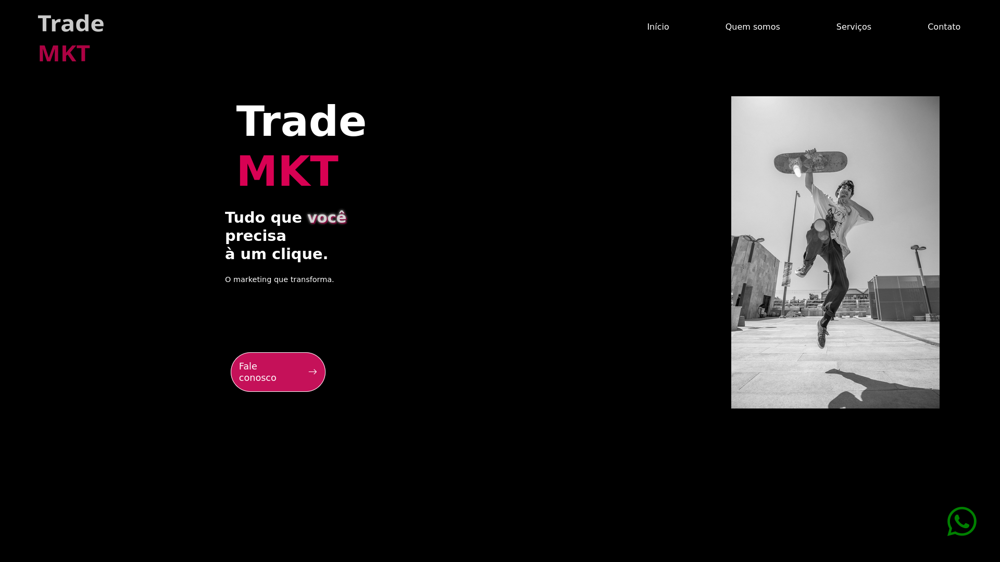

# 🚀 Trade MKT

Site institucional moderno e responsivo para a **Trade MKT**, uma empresa de marketing digital fícticia, focada em conectar pessoas e negócios através de estratégias criativas, tecnologia e resultados.

 <!-- opcional, pode remover se não tiver print -->

---

## ✨ Funcionalidades

- 🌐 **Navbar responsiva** com rolagem suave entre seções  
- 📢 **Seção de serviços** com cards informativos e CTA  
- 👥 **Quem somos** apresentando a empresa e valores  
- 🏷️ **Clientes** exibindo marcas parceiras  
- ⭐ **Avaliações dinâmicas** de clientes com navegação e indicadores  
- 📩 **Formulário de contato** integrado com **EmailJS**  
- 📱 **Botão de WhatsApp fixo** para contato rápido  
- ⬆️ **Botão “voltar ao topo”** com barra de progresso animada  
- 🎨 **Design moderno**, com tipografia do Google Fonts e ícones do **Bootstrap Icons**

---

## 🛠️ Tecnologias Utilizadas

- **HTML5** e **CSS3**  
- **JavaScript (ES6+)**  
- **EmailJS** (integração de formulário)  
- **Lenis** (scroll suave)  
- **Bootstrap Icons**  
- **Google Fonts** (Bebas Neue)  

---

## 📂 Estrutura de Pastas

```bash
.
├── index.html
├── css/
│   └── styles.css
├── js/
│   └── script.js
├── asssets/
│   └── imagens/
│       ├── favicon.ico
│       ├── logo.png
│       ├── ...
